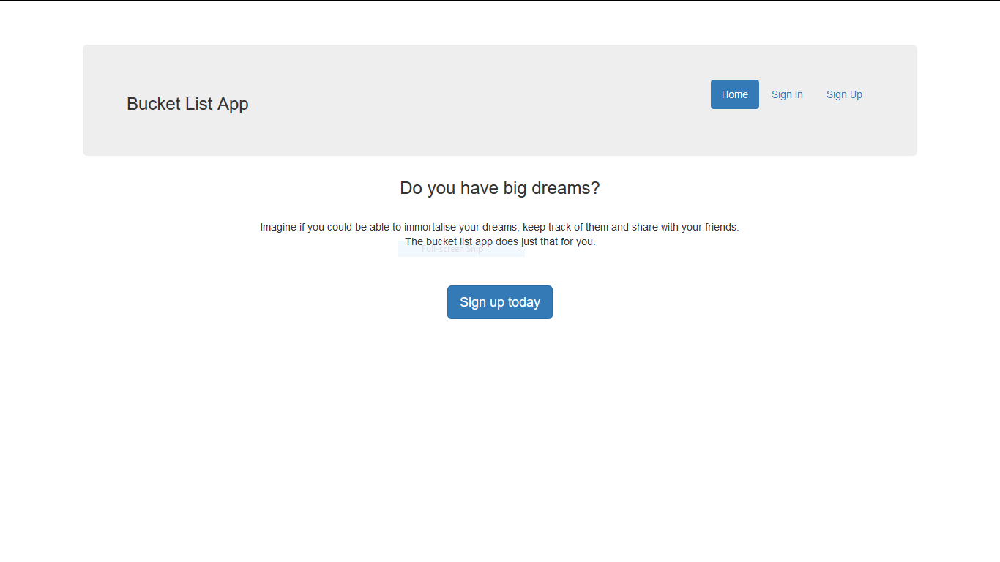
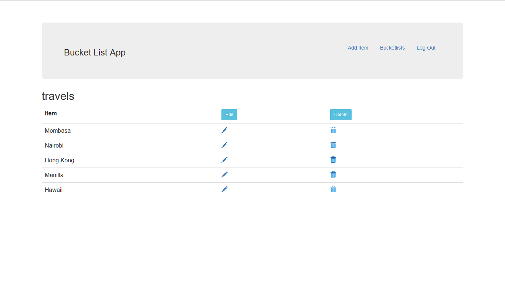

[](https://travis-ci.org/ndero/andela_challenge_two)

A simple bucket list App - Andela pre-fellowship challenge 2
-------------------------------------------------------------------
A bucket list app using python flask that allows users to **sign up, login, create and edit** bucketlists. It also allows users to add and edit items/activities to these bucketlists. The app doesn't make use of a database. Users' data is stored in a list and is non persistent.

Task list
------------------------------------- 
- [x] Setting up python flask, pylint and virtual environment. Recommend installation of Visual Studio Code for pylinting.
- [x] Setting up unit testing - these are in `tests.py`
- [x] OOP features - these enables users to create, read, update and delete non persistent data. Found in `models.py`
- [x] Creating a user interface to access the functionality above - `templates` folder
- [x] Integrating TravisCI in the repository - the badges added at the beginning of this `readme` file. 
- [ ] Integrating test coverage reporting with badge in the ReadMe.
- [x] Deploying the application hosted to Heroku. You can run the [Bucketlist Application](https://boiling-plains-35990.herokuapp.com) hosted at Heroku. 

How to run the app from your computer
-------------------------------------
Follow the following steps to run this app locally. Assuming you have `git` and `python 3.6` installed on your machine. 

```
#Clone this code repository into ~/bucketlist. 
git clone https://github.com/ndero/andela_challenge_two.git

#Create a virtual environment and install modules using requirements.txt
pip install -r requirements.txt

#Run the unit tests 
nosetests --with-coverage

#Run the app
python app.py

#Open your browser and go to the link localhost:5000

```

Sreenshots of the app.
-----------------------------------




